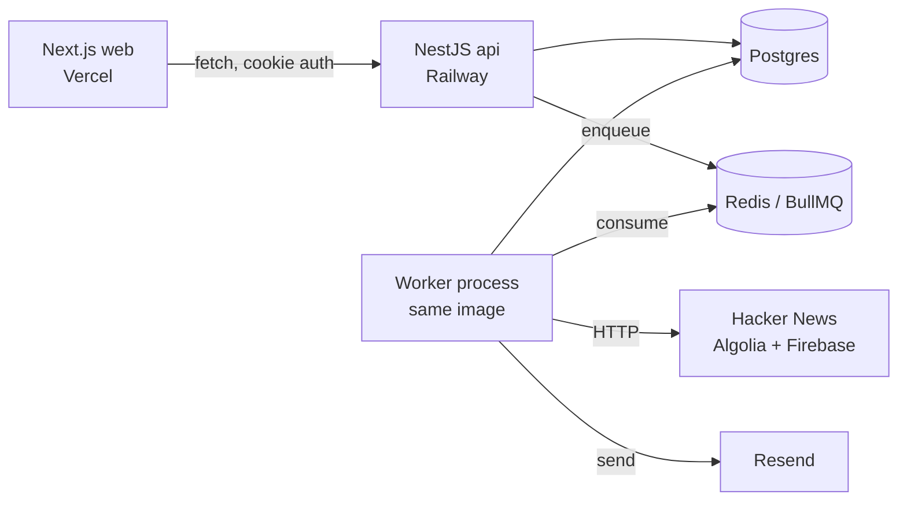

# Reel

**A job-hunt tracker that does the boring part for you** — it reads the monthly Hacker News
"Who is hiring?" thread, scores every posting against criteria you set, and chases you when an
application goes quiet.

> Live: _pending deploy_ · See [docs/DEPLOY.md](docs/DEPLOY.md)
>
> _Demo GIF goes here once the app is deployed._

## Why

Job hunting fails on logistics, not ambition. The good postings are buried in a thread with a
thousand comments, and the ones you do send disappear into silence — you find out weeks later
that you never followed up on the one that mattered. Reel turns both halves into something a
computer handles: it reads the thread for you, and it remembers what you forgot.

## What it does

**Inbox** — every posting scored against your criteria, highest first, with the reasons shown as
chips (`remote`, `role:full stack`, `stack:typescript`). Dismiss the noise, save the rest.

**Pipeline** — saved roles move through `SAVED → APPLIED → INTERVIEWING → OFFER`, with every
transition written to an immutable history. Invalid moves are rejected by the server, not just
hidden in the UI.

**Reminders** — ten days after you mark something APPLIED, a follow-up email arrives. Move the
application on and the reminder cancels itself.

_Screenshots pending deploy._

## Architecture



The API and the worker are **the same image with a different command**. The API only ever
enqueues; it never waits on HN or on an email provider, so no request is hostage to a third
party being slow. The worker owns everything with a clock in it: the six-hourly ingest
scheduler and the delayed reminder jobs. Either can restart without the other noticing, and
scaling the ingest never means scaling the HTTP tier.

## Decisions and trade-offs

**A separate worker process, not `@Cron` in the API.** A cron decorator inside the API means
every replica fires the same job. BullMQ's scheduler dedupes by key, and the worker can be
restarted or scaled independently of request traffic.

**Reminders are idempotent by construction.** The job id is derived from the application id
(`stale-<id>`), so re-scheduling replaces rather than duplicates. The processor then re-reads
the database and compares `stageChangedAt` against the value captured when the job was queued —
if the application moved on, or moved out and back, the email is skipped. Deleting a queue job
is best-effort; correctness lives in the re-check, not the delete.

**Ingestion upserts on `(source, externalId)`.** Re-running an ingest over the same thread is
free, so retries and overlapping runs are safe. Created versus updated counts come from one
`findMany` of existing ids, not a query per comment.

**The parser is pure and fixture-tested.** `parseComment(item)` takes an HN item and returns a
plain object — no database, no network, no Nest. Real comments become fixtures, so fixing a
parse bug means adding the comment that broke it and watching the test go red first.

**JWT in an httpOnly cookie, not localStorage.** A token in `localStorage` is readable by any
script that gets onto the page. The cookie costs a CORS configuration and is invisible to XSS.

**Offset pagination.** Cursors are better under churn, but this dataset is roughly a thousand
rows a month and offsets keep the client trivial. At a hundred times the volume the ordering
key becomes the cursor.

**No refresh tokens.** One seven-day cookie. A real multi-device product needs rotation and
revocation; a single-user tool does not, and pretending otherwise would be the more expensive
mistake.

## Testing

| Layer | Runner                                             | Count             |
| ----- | -------------------------------------------------- | ----------------- |
| Unit  | Vitest                                             | 67 across 9 files |
| E2E   | Vitest + supertest against real Postgres and Redis | 27 across 6 files |

Pure logic — the parser, the scorer, the stage machine, keyword normalisation — is tested
without Nest at all. Services are tested with mocked Prisma and queues. HTTP is tested end to
end through a bootstrap helper (`apps/api/test/create-app.ts`) that applies the same middleware
as `main.ts`, so a mistake in helmet or cookie parsing fails a test instead of shipping.

E2E specs run serially: they share one database, and concurrent fixture teardown was corrupting
other specs' writes.

CI runs lint → format → typecheck → build → test on every push, with Postgres and Redis service
containers.

## Run locally

```bash
docker compose up -d
pnpm install
cp apps/api/.env.example apps/api/.env
pnpm db:generate
pnpm db:migrate
pnpm db:seed
pnpm dev
```

API: http://localhost:4000/api/v1/health · Web: http://localhost:3000

`pnpm dev` runs three processes: API, worker, and web.

## Checks

```bash
pnpm lint && pnpm format:check && pnpm typecheck && pnpm test && pnpm test:e2e
```

## Container

```bash
docker build -f apps/api/Dockerfile -t reel-api .
docker run -p 4000:4000 --env-file apps/api/.env reel-api
```

**Healthcheck path:** `GET /api/v1/health` — `200 {"status":"ok","db":true,"redis":true}` when
Postgres and Redis both answer, `503` otherwise.

## Deploy

See [docs/DEPLOY.md](docs/DEPLOY.md) — Railway for the API and worker, Vercel for the web app,
every environment variable and where it comes from.

## What I'd do next

- **A second source.** The ingest pipeline is source-shaped already (`Source` enum, per-source
  external ids); Wellfound or a company board would slot in beside HN.
- **Full-text search.** `ILIKE` over three columns is fine at a thousand rows and wrong at a
  hundred thousand. Postgres `tsvector` with a GIN index is the next step.
- **Per-user ingest filters.** Today every user scores every posting. Filtering at ingest time
  would cut the rescore loop dramatically once there is more than one user.
- **Refresh tokens.** Needed the moment this is used from more than one device.
- **A better headline parser.** The current segment rules follow the HN convention, and roughly
  one posting in ten does not. Each miss is a fixture waiting to be written.
