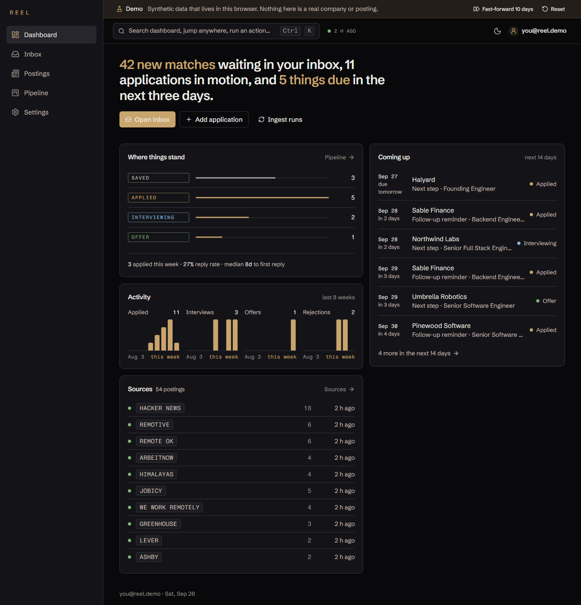
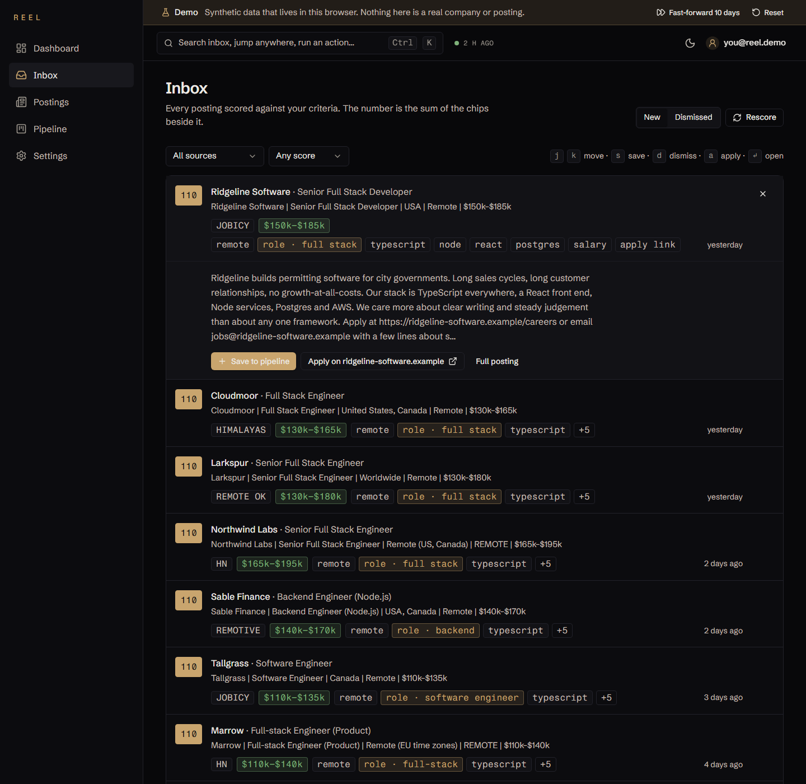
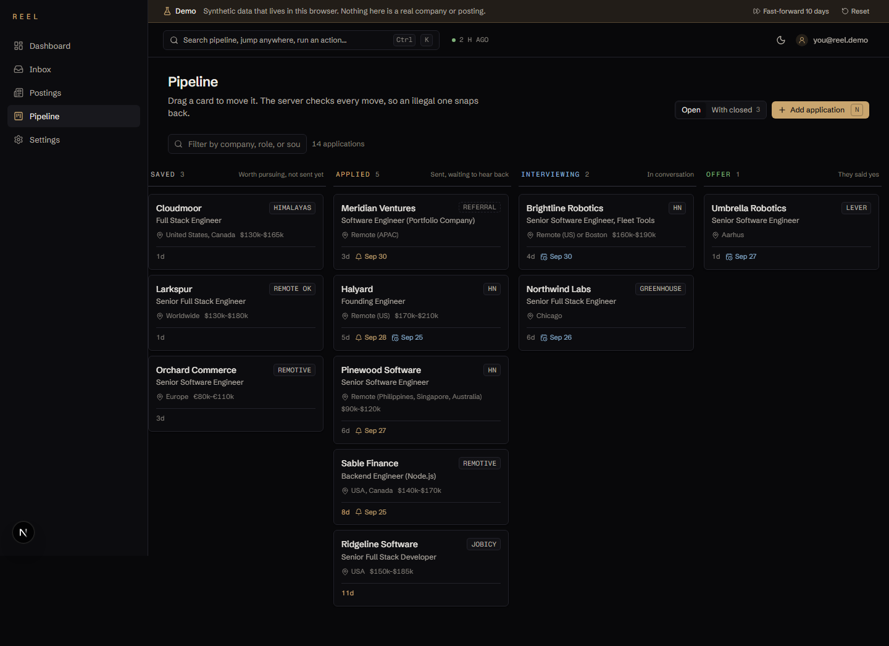
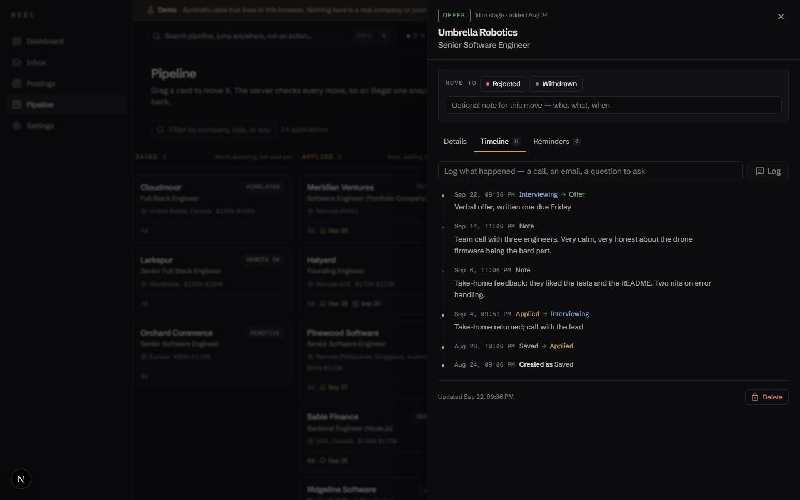
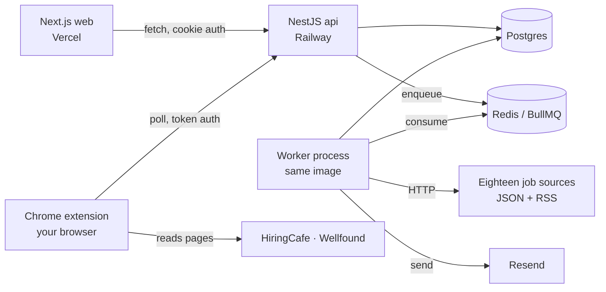
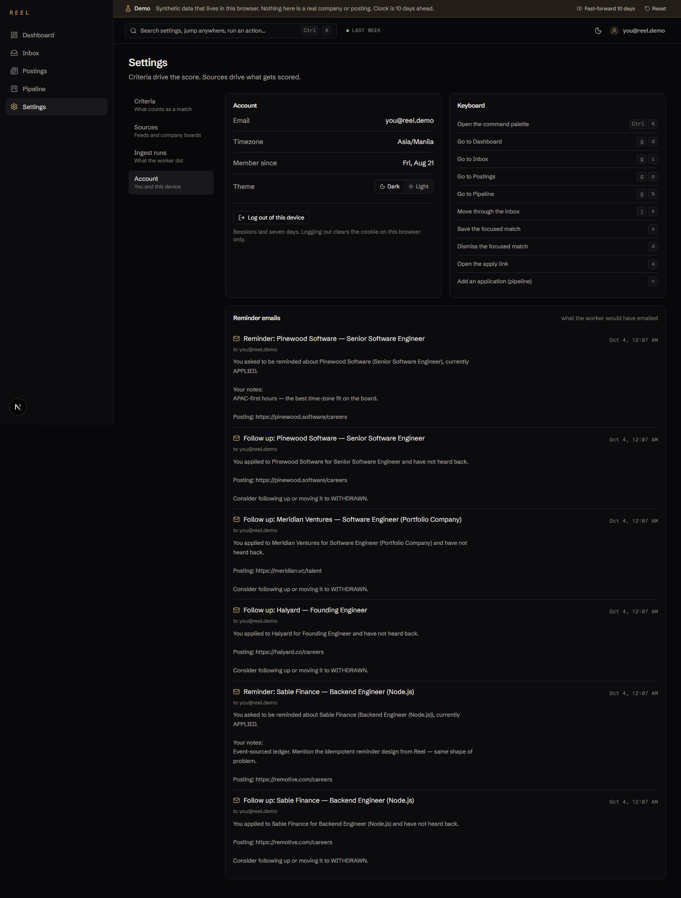

# Reel

**A job-hunt tracker that does the boring part for you.** Reel reads twenty job sources on
a schedule, scores every posting against criteria you set, and tracks each application from saved
to offer with reminders that only fire when something has gone quiet.

> **Live demo:** [reel.jadebonifacio.dev](https://reel.jadebonifacio.dev) · **Stack:** NestJS 12 ·
> Prisma 7 · Postgres · Redis / BullMQ · Next.js 16 · TanStack Query



## Why

Job hunting fails on logistics, not ambition. The good postings are spread across a dozen
boards and a thousand-comment thread, and the applications you do send disappear into silence
until you realise, weeks later, that you never followed up on the one that mattered. Reel turns
both halves into something a computer does: it reads the boards for you, and it remembers what
you forgot.

## What it does

**Twenty sources, one inbox.** Hacker News "Who is hiring?", Remotive, Remote OK, Arbeitnow,
Himalayas, Jobicy, We Work Remotely (four categories), Working Nomads, Landing.jobs, The Muse
Jobspresso, JobStreet Philippines and Kalibrr as feeds, plus any company careers page on
Greenhouse, Lever, Ashby, Workable or SmartRecruiters that you watch. HiringCafe and Wellfound
block servers, so a small Chrome
extension reads them from inside your browser and hands the jobs to the same pipeline. Every posting is parsed into the same shape and scored against
your criteria. The score is the sum of the chips beside it — `remote`, `role · full stack`,
`typescript` — and the rules are plain arithmetic you can read in the settings.



**A pipeline you can trust.** Saved → Applied → Interviewing → Offer, with Rejected and Withdrawn
as exits. Drag a card between columns; the server enforces the allowed moves and every change is
written to an immutable timeline alongside your notes, contacts and next steps. Applications
found anywhere — a referral, LinkedIn, a friend — go in by hand and get the same treatment.



**Reminders that don't nag twice.** Ten days after you mark something Applied, an email arrives.
Move it on and the reminder cancels itself. Set your own follow-up date on any application. The
job id is deterministic and the worker re-reads the database before sending, so a reminder can
never fire twice or fire for something that already moved.



## Architecture


```mermaid
flowchart LR
  Web[Next.js web<br/>Vercel] -->|fetch, cookie auth| API[NestJS api<br/>Railway]
  API --> PG[(Postgres)]
  API -->|enqueue| R[(Redis / BullMQ)]
  W[Worker process<br/>same image] -->|consume| R
  W --> PG
  W -->|HTTP| S[Eighteen job sources<br/>JSON + RSS]
  X[Chrome extension<br/>your browser] -->|poll, token auth| API
  X -->|reads pages| B[HiringCafe · Wellfound]
  W -->|send| M[Resend]
```

The API and the worker are **the same image with a different command**. The API only ever
enqueues; it never waits on a job board or an email provider. The worker owns everything with a
clock in it: the six-hourly `ingest-all` scheduler, the per-source `ingest-source` jobs it fans
out to, and the delayed reminder jobs. Either process restarts without the other noticing.

Each source is an **adapter** — one class, one network call, one pure `mapX(payload)` function
tested against a fixture captured from the live API. A pure `normalizePosting()` turns every
adapter's output into the same `Posting` row, so the scorer, the inbox and the pipeline never
learned a second shape when nine sources joined the first.

## Decisions and trade-offs

**A separate worker process, not `@Cron` in the API.** A cron decorator inside the API means
every replica fires the same job. BullMQ's scheduler dedupes by key, and the worker scales
independently of request traffic.

**Fan-out ingest, one run per source.** `ingest-all` does no fetching; it enqueues one job per
enabled source and watched board. A board that times out fails and retries alone, and the
settings page can show exactly which source is unhappy.

**Reminders are idempotent by construction.** Job ids derive from the application id
(`stale-<id>`, `followup-<id>`), so rescheduling replaces rather than duplicates. The processor
re-reads the row and the application before sending. Deleting a queue job is best-effort;
correctness lives in the re-check.

**Pure parsing, fixture-tested.** The HN comment parser, the source normaliser, the scorer and
the stats summary are plain functions with no framework in them. Real payloads become fixtures;
fixing a parse bug means adding the payload that broke it and watching the test go red first.
The most recent such bug: Hacker News entity-encodes `href` attributes, which no fixture had
caught until the UI showed "Apply on &".

**Hand-written rename migrations.** When `threadId` became `boardId`, Prisma's generated
migration would have dropped the column and its 264 rows. The migration says
`ALTER TABLE … RENAME COLUMN` instead, and `prisma migrate diff` confirms the schema and the
database agree afterwards.

**One seam for the network.** Every request in the web app goes through one `apiFetch`. That is
what makes the demo build possible: in demo mode that function hands the call to an in-browser
implementation of the same contract, and no page or component knows.

**JWT in an httpOnly cookie, offset pagination, no refresh tokens.** The v1 choices held: a
cookie is invisible to XSS at the cost of a CORS configuration; offsets are fine at a few thousand
rows; a single-user tool does not need rotation.

## Testing

| Layer | Runner                                             | Count               |
| ----- | -------------------------------------------------- | ------------------- |
| Unit  | Vitest                                             | 125 across 14 files |
| E2E   | Vitest + supertest against real Postgres and Redis | 47 across 7 files   |

Pure logic — the parser, the twenty adapter mappers, the normaliser, the scorer, the stage machine,
the stats summary — is tested without Nest. Services are tested with mocked Prisma and queues.
HTTP is tested end to end through the same middleware as production, so a mistake in helmet or
cookie parsing fails a test instead of shipping. CI runs lint → format → typecheck → build →
unit → e2e on every push with Postgres and Redis service containers.

## Demo

The live demo at [reel.jadebonifacio.dev](https://reel.jadebonifacio.dev) is this build. The
interface can run with no backend at all. Built with `NEXT_PUBLIC_DEMO_MODE=true`, the web app
answers its own API calls in the browser from seeded, synthetic data (fifty-four postings across
all ten sources, fourteen applications with histories, two ingest cycles), persisted in
`localStorage`. The demo banner can reset the data or fast-forward the clock ten days so pending
reminders fire and their emails appear under Settings → Account. Everything in the demo is
invented; nothing names a real employer.



## Run locally

```bash
docker compose up -d
pnpm install
cp apps/api/.env.example apps/api/.env
pnpm db:generate
pnpm db:migrate
pnpm db:seed
pnpm dev
```

API: http://localhost:4000/api/v1/health · Web: http://localhost:3000. `pnpm dev` runs three
processes: API, worker, and web. For the demo build instead:
`NEXT_PUBLIC_DEMO_MODE=true pnpm --filter web dev`.

## Checks

```bash
pnpm lint && pnpm format:check && pnpm typecheck && pnpm test && pnpm test:e2e
```

## Deploy

See [docs/DEPLOY.md](docs/DEPLOY.md) — Railway for the API and worker, Vercel for the web app
and for the free demo build, every environment variable and where it comes from.

## Reading the code

`reviewers/` holds one document per build step, written to be read after the code: what the
step adds, the files in reading order, the concepts, and what actually broke. Start with
[reviewers/README.md](reviewers/README.md). `docs/PLAN.md` is the plan the code was built from
and the record of every decision that changed along the way.

## What I'd do next

- **Full-text search.** `ILIKE` over three columns is fine at two thousand rows and wrong at two
  hundred thousand. Postgres `tsvector` with a GIN index is the next step.
- **Per-user ingest filters.** Every user scores every posting today. Filtering at ingest time
  cuts the rescore loop once there is more than one user.
- **A better headline parser for HN.** The pipe convention covers nine postings in ten. Each miss
  is a fixture waiting to be written.
- **Refresh tokens.** The moment this is used from more than one device.
